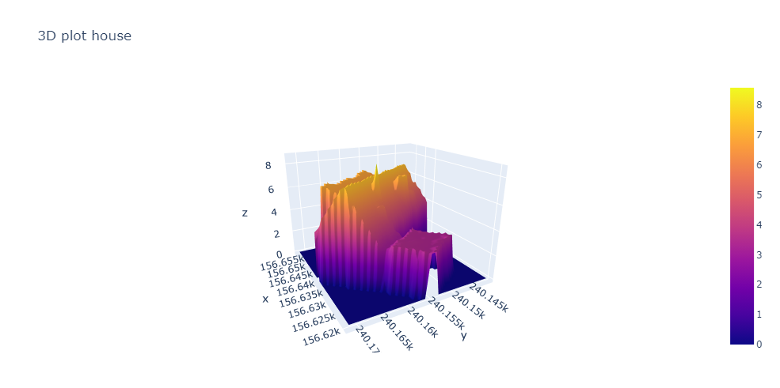
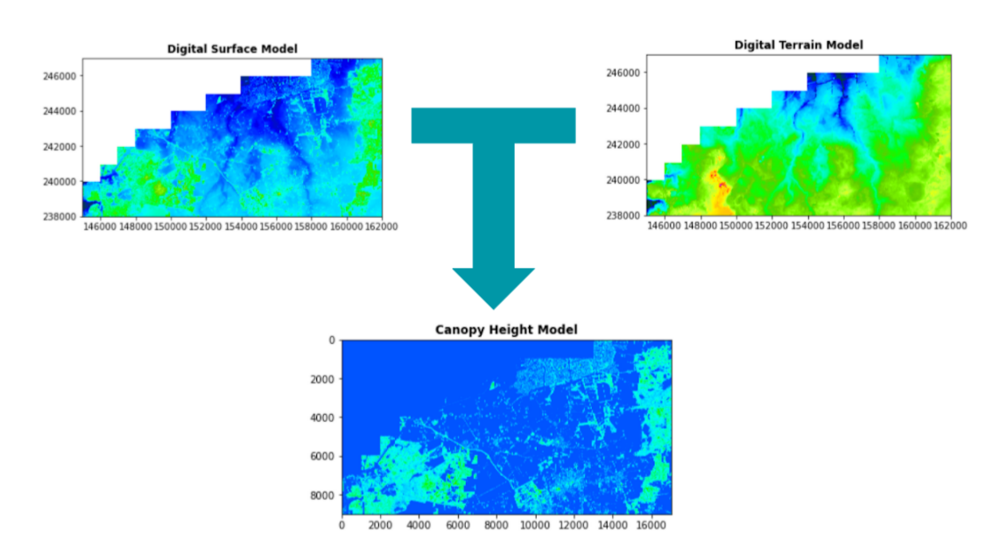
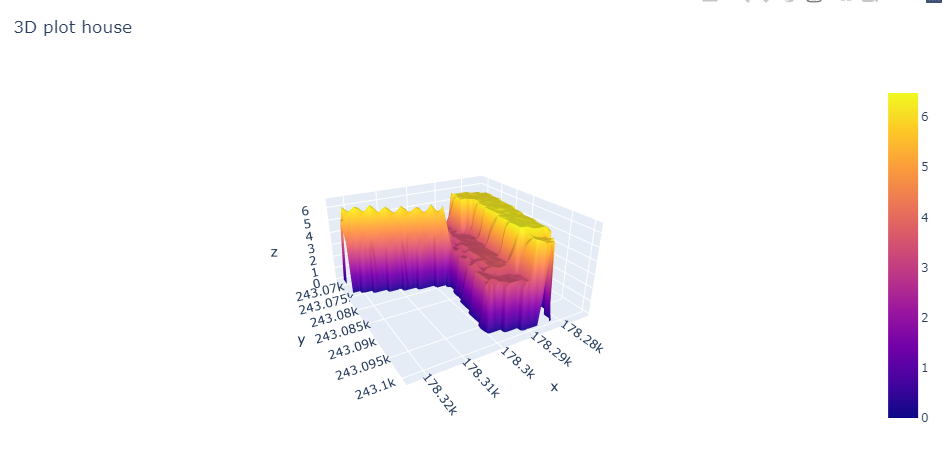

Project status: currently updating

<h1 align="center"> <strong>3D House Project</strong> </h1>

|  |
|:-:|
| Result example |

- Repository: 3D-House-Project
- Type of Challenge: Learning & Consolidation
- Duration: 2 weeks

---

## **Table of Contents**
Your section headers will be used to reference the location of the destination.

- [Description](#description)
- [How To Use](#how-to-use)
- [Repo Artitecture](#repo-artitecture)
- [Next Step](#next-step)
- [License](#license)
- [Author Info](#author-info)

## **Description**

### *Mission Objectives*
3D plot a user-given address (located within Flanders, Belgium) and plot the house/building that is associated with this address.

### *Learning Objectives*

to be able to search and implement new librairies
to be able to read and use shapefiles
to be able to read and use geoTIFFs
to be able to render a 3D plot
to be able to present a final product

### *The Setting*

We are LIDAR PLANES , active in the Geospatial industry. We would like to use our data to launch a new branch in the insurrance business. So, we need you to build a solution with our data to model a house in 3D with only a home address.

 

### **Technologies**
 

| Library          | Used to                                        |
| ---------------- | :----------------------------------------------|
| numpy            | To handle Numpy arrays                         |
| pandas           | To store and access info in a DataFrame        |
| matplotlib       | To plot the data                               |
| request          | To make request to an API                      |
| jupyter          | To open Jupyter Notebook                       |
| plotly           | To plot in (interactive) 3D                    |
| rasterio         | To open and handle LIDAR files                 |
| rioxarray        | To convert LIDAR files into arrays             |

[**↥ Back To The Top**](#table-of-contents)

### Must-have features

3D lookup of houses.

### Nice-to-have features

Optimize your solution to have the result as fast as possible.
Features like the living area of the house in m², how many floors, if there is a pool, the vegetation in the neighborhood, etc...
Better visualization.

### Miscellaneous information

What is LIDAR ?
LIDAR is a method to measure distance using light. The device will illuminate a target with a laser light and a sensor will measure the reflection. Differences in wavelength and return times will be used to get 3D representations of an area.

### Lidar Segmentation

With those points clouds we can easily identify houses, vegetation, roads, etc...
The results we're insterested in are DSM (Digital Surface Map) and DTM (Digital Terrain Map).
Which are already computed and available here: DSM, DTM

## How does it work

This will be added.

|  |
|:-:|
| CHM = DSM - DTM |

## Results

These are examples of results of adresses in Belgium (the precise location will not be shared out of privacy).

|   |   |
|:-:|:-:|
| Result example 1 | Result example 2 | 

## *Thank you for reading*
